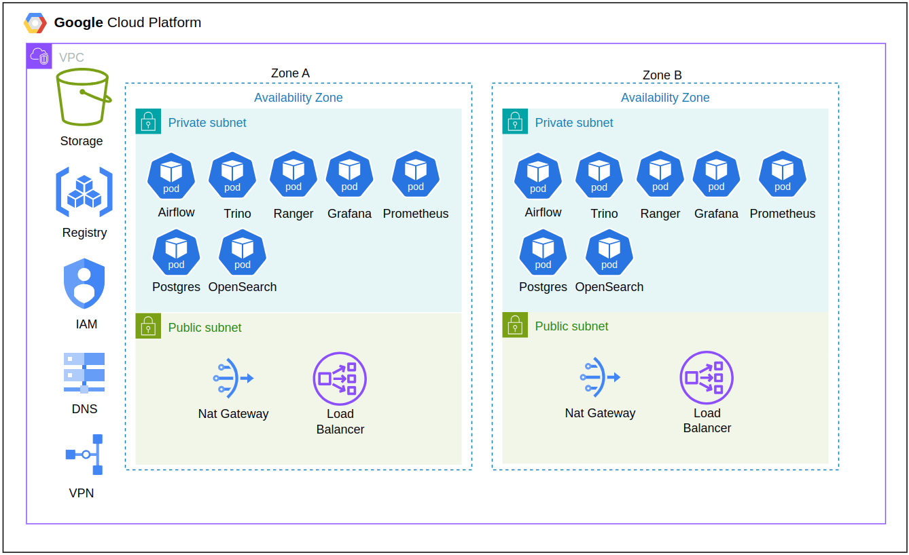

# suzano-challenge

This challenge involves building a data pipeline to extract financial data from the **investing.com** website. The challenge requires the use of cloud resources, and the data platform stack consists of the following tools:

- **Provider**: GCP (Google Cloud Platform)
- **Storage**: GCS (Google Cloud Storage) and OpenSearch
- **Lakehouse**: Trino
- **Orchestrator**: Airflow
- **Ingestion**: Python
- **Data Quality**: DBT
- **Catalog**: DBT
- **Infrastructure**: Docker, Kubernetes, and Terraform (IAC)
- **Data Security and Monitoring**: Apache Ranger
- **Observability**: Grafana and Prometheus

## Repository Structure
The repository is structured as follows:

```bash
├── dags
│   ├── dbt
│   │   ├── dbt_project.yaml
│   │   ├── Dockerfile
│   │   ├── models
│   │   │   ├── raw_bloomberg_commodity_index.sql
│   │   │   ├── raw_chinese_caixin_services_index.sql
│   │   │   └── raw_usd_to_cny.sql
│   │   ├── profile.yml
│   │   ├── requirements.txt
│   │   └── schema.yaml
│   ├── include
│   │   ├── constants.py
│   │   └── utils.py
│   └── investing_dag.py
├── Dockerfile
├── docs
│   ├── infra.png
│   ├── README.md
│   └── test.md
├── infra
│   ├── dns.tf
│   ├── gcr.tf
│   ├── gcs.tf
│   ├── gke.tf
│   ├── k8s
│   │   ├── charts
│   │   │   ├── airflow
│   │   │   │   └── values.yaml
│   │   │   ├── apache_ranger
│   │   │   │   ├── config
│   │   │   │   │   └── install.properties
│   │   │   │   └── values.yaml
│   │   │   ├── grafana
│   │   │   │   └── values.yaml
│   │   │   ├── opensearch
│   │   │   │   └── values.yaml
│   │   │   ├── prometheus
│   │   │   │   └── values.yaml
│   │   │   └── trino
│   │   │       └── values.yaml
│   │   └── templates
│   │       ├── gateway.yaml
│   │       ├── pv-airflow.yaml
│   │       ├── pvc.yaml
│   │       └── virtual_services.yaml
│   ├── provider.tf
│   ├── vars.tf
│   ├── vpc.tf
│   └── vpn.tf
├── pyproject.toml
├── README.md
└── tests
    └── test_invest_dag.pyc
```
- **`dags/`**: Contains the logic for the data pipeline, including the Airflow DAGs.
  - **`dags/dbt/`**: Contains the scripts for Data Quality and the data catalog, utilizing DBT.
  - **`dags/include/`**: Contains reusable Python functions for the Airflow DAGs.
  - **`dags/investing_dag.py`**: Defines the Airflow DAG for the Investing data pipeline.

- **`infra/`**: Contains the provisioning for all infrastructure, including Terraform and Kubernetes.
  - **`infra/dns.tf`**: Terraform configuration for DNS.
  - **`infra/gcr.tf`**: Terraform configuration for Google Container Registry.
  - **`infra/gcs.tf`**: Terraform configuration for Google Cloud Storage.
  - **`infra/gke.tf`**: Terraform configuration for Google Kubernetes Engine.
  - **`infra/k8s/`**: Contains Kubernetes and Helm chart files for various services.
    - **`infra/k8s/charts/`**: Contains Helm charts for deploying services in Kubernetes (e.g., Airflow, Apache Ranger, Grafana, Prometheus, etc.).
    - **`infra/k8s/templates/`**: Kubernetes resource templates like gateways, persistent volumes, and virtual services.
  - **`infra/provider.tf`**: Terraform configuration for the GCP provider.
  - **`infra/vars.tf`**: Definition of Terraform variables.
  - **`infra/vpc.tf`**: Terraform configuration for setting up the VPC.
  - **`infra/vpn.tf`**: Terraform configuration for setting up the VPN.

- **`tests/`**: Contains validation tests for the Airflow DAGs.
  - **`tests/test_invest_dag.pyc`**: Compiled test file for the `investing_dag.py`.

- **`pyproject.toml`**: The project dependency manager, listing the required Python libraries.

- **`Dockerfile`**: The image used in the Helm Chart for Airflow, which was deployed on Kubernetes.

- **`.github/workflows/ci.yaml`**: The CI pipeline ensuring that the DAGs will be executed. This file also includes URLs for the Helm Charts of Trino and Airflow, as well as the Elastic Search URLs for the modules used.

- **`.github/workflows/cd.yaml`**: The CD pipeline ensuring that Airflow and DBT will be deployed.

## Proposed Architecture


## References
- **Investpy Documentation**: [https://pypi.org/project/investpy/](https://pypi.org/project/investpy/)
- **Terraform VPC Module**: [https://registry.terraform.io/modules/terraform-google-modules/network/google/latest](https://registry.terraform.io/modules/terraform-google-modules/network/google/latest)
- **Terraform DNS Module**: [https://registry.terraform.io/modules/terraform-google-modules/cloud-dns/google/latest](https://registry.terraform.io/modules/terraform-google-modules/cloud-dns/google/latest)
- **Terraform VPN Module**: [https://registry.terraform.io/modules/terraform-google-modules/vpn/google/latest](https://registry.terraform.io/modules/terraform-google-modules/vpn/google/latest)
- **Terraform GKE Module**: [https://registry.terraform.io/modules/terraform-google-modules/kubernetes-engine/google/latest](https://registry.terraform.io/modules/terraform-google-modules/kubernetes-engine/google/latest)
- **Trino Helm Chart**: [https://github.com/trinodb/charts/blob/main/charts/trino/values.yaml](https://github.com/trinodb/charts/blob/main/charts/trino/values.yaml)
- **Airflow Helm Chart**: [https://github.com/apache/airflow/blob/main/chart/values.yaml](https://github.com/apache/airflow/blob/main/chart/values.yaml)
- **OpenSearch Helm Chart**: [https://github.com/opensearch-project/helm-charts/blob/main/charts/opensearch/values.yaml](https://github.com/opensearch-project/helm-charts/blob/main/charts/opensearch/values.yaml)
- **Grafana Helm Chart**: [https://github.com/grafana/helm-charts/blob/main/charts/grafana/values.yaml](https://github.com/grafana/helm-charts/blob/main/charts/grafana/values.yaml)
- **Prometheus Helm Chart**: [https://github.com/prometheus-community/helm-charts/blob/main/charts/prometheus/values.yaml](https://github.com/prometheus-community/helm-charts/blob/main/charts/prometheus/values.yaml)
- **Apache Ranger Documentation**: [https://ranger.apache.org/](https://ranger.apache.org/)
- **Istio Load Balancer**: [https://istio.io/](https://istio.io/)
